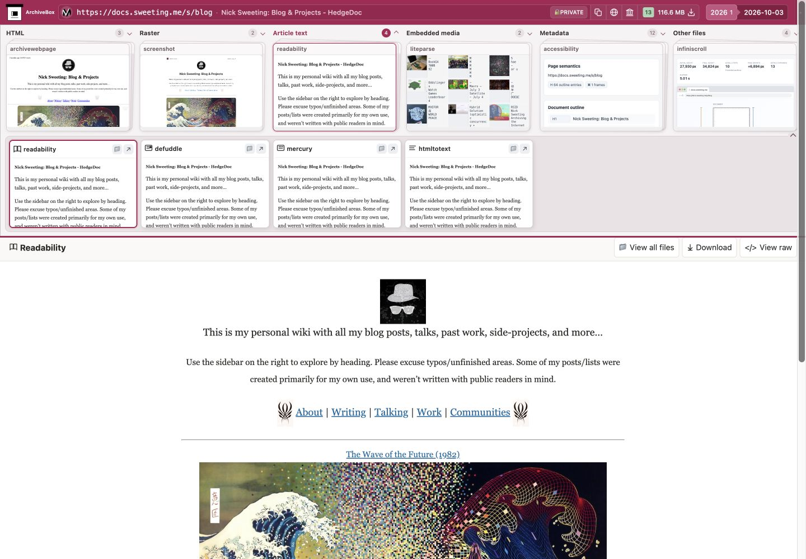
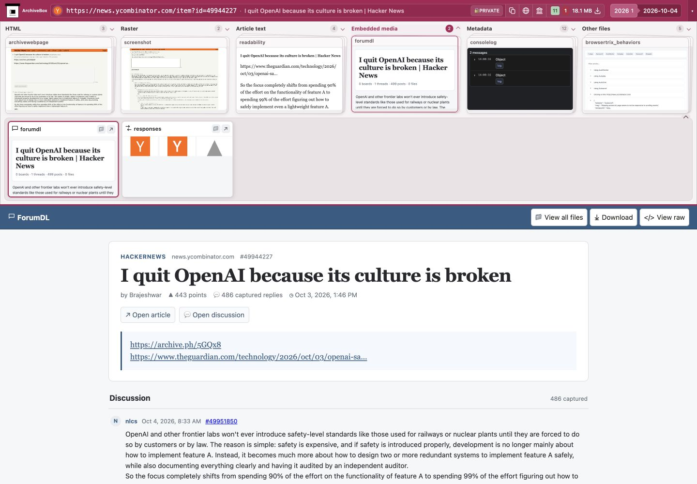
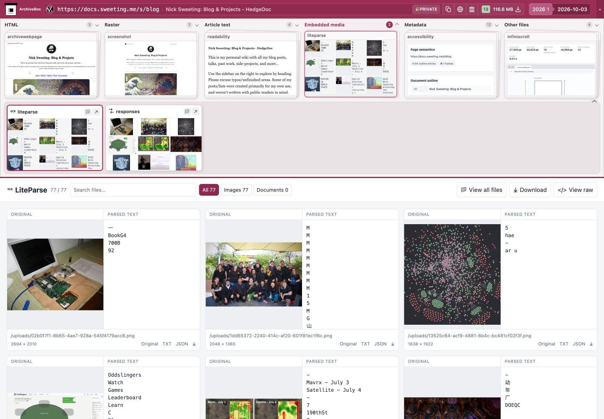

<div align="center">
  
  <h1>archivebox-wacz-replay</h1>
  <p><strong>Open a web archive. Explore everything it captured.</strong></p>
  <p>WACZ · WARC · ZIP · Offline replay · ArchiveBox cards &amp; plugin views</p>
  <p>
    <a href="#-get-started">Get started</a> ·
    <a href="#-explore-a-capture">Features</a> ·
    <a href="#-archive-compatibility">Compatibility</a> ·
    <a href="#hosting">Hosting</a> ·
    <a href="#development">Development</a>
  </p>
  <p>
    <a href="LICENSE"></a>
    
  </p>
</div>



A standalone viewer built from **ArchiveBox's existing snapshot detail UI** and
Webrecorder's replay engine. Open archives from your computer or a URL, then move
between the original page, readable articles, screenshots, documents, media,
recorded HTTP exchanges, and files.

- 🗃️ **Bring your own archive.** Open `.wacz`, `.warc`, `.warc.gz`, or `.zip`, including captures made outside ArchiveBox.
- 🃏 **Browse the familiar stacks and cards.** Expand an output stack, preview its cards, and open the full plugin view.
- 🧩 **Discover more in the recorded content.** Derive article text, search, OCR, forums, and other applicable views from saved responses.
- 🔎 **Inspect the evidence.** Browse files and nested ZIPs, inspect request/response headers, read JSONL records, and check package hashes.
- 📦 **Run independently.** A static website with bundled JavaScript, Python/WASM, and OCR engines. No ArchiveBox server or extension required.

**Preview:** real captures are exercised in Chromium, including large blog archives
and forum discussions. Compatibility across every browser, producer, and plugin
is still being verified; see [tested coverage](#-archive-compatibility).

## 🚀 Get started

**Requirements:** Node.js 22.12+, pnpm 10, and a desktop Chromium browser for the
currently verified experience.

```sh
git clone https://github.com/ArchiveBox/archivebox-wacz-replay.git
cd archivebox-wacz-replay
pnpm install --frozen-lockfile
pnpm build
pnpm preview --port 4178
```

1. Open **[localhost:4178](http://localhost:4178)**.
2. Select or drop an archive, or enter its HTTP(S) URL.
3. Choose a card in the snapshot's output stacks to explore that view.

Build before previewing: the replay service worker and bundled engines are part
of the production output. Use HTTPS or localhost; opening `index.html` through
`file://` is not supported.

## 🧭 Explore a capture

| View | What you can explore |
| --- | --- |
| **HTML** | Interactive archived pages, DOM, and derived SingleFile views |
| **Raster** | Saved screenshots and screenshot tiles; browser Print / Save as PDF |
| **Article text** | Readability, Defuddle, Mercury, and plain-text views |
| **Embedded media** | Applicable document, OCR, forum, gallery, and media views |
| **Metadata** | Recorded HTTP exchanges, search, and saved browser observations |
| **Other files** | Plugin outputs, package members, nested ZIPs, and downloads |

Cards depend on the **evidence inside the archive**. Ordinary WARCs and third-party
WACZs get the same interface: ArchiveBox hook records are not required for derived
views. Screenshots, accessibility trees, and other capture-time observations need
their original saved artifacts.

<table>
<tr>
<td width="50%"></td>
<td width="50%"></td>
</tr>
<tr>
<td align="center"><sub>A real Hacker News discussion with 486 rendered replies</sub></td>
<td align="center"><sub>Images and OCR from a 117 MB blog capture</sub></td>
</tr>
</table>

The **Other files** stack opens the ZIP/WACZ file browser. Archive results, original
JSONL metadata, and integrity checks sit below the selected output. Individual
cards can open in their own tabs; the header's download control returns the
original archive bytes unchanged.

<details>
<summary><strong>Local storage, missing resources, and metadata</strong></summary>

- Local inputs are copied into the browser's Origin Private File System (OPFS), so replay frames and output tabs can read them on demand. Reload retains the open archive. Returning to the archive picker through the ArchiveBox header removes its local source copy.
- Derived views work from recorded responses. Missing resources remain missing; replay does not fetch them from the original site. Derivations do not alter the original package or invent successful capture records.
- ArchiveBox browser records and server-style `Snapshot` / `ArchiveResult` JSONL records enrich views when present. Unknown plugins remain accessible through files and metadata.
- Malformed or unsupported optional metadata produces a notice without hiding the package. ZIPs without a replay index remain browsable as files.
- This is viewer storage, not an ArchiveBox collection or a sync client.

</details>

## 🌍 Archive compatibility

Real Chromium acceptance tests cover these producer outputs:

| Producer | Tested format | Verified behavior |
| --- | --- | --- |
| **GNU wget 1.25.0** | WARC 1.0, plain and gzip | HTML, CSS, JavaScript, images, iframes, navigation, reload, original-byte downloads |
| **grab-site 2.2.7 / wpull 3.0.9** | WARC 1.0, plain and gzip | The same offline crawler replay checks |
| **ArchiveWeb.page 0.15.1** | WACZ 1.1.1 | Main page, nested iframe, package hashes, reload, original-byte downloads |
| **ArchiveBox JS** | WACZ with plugin artifacts and JSONL | Replay, screenshots, derived SingleFile, metadata, package hashes, reload, original-byte downloads |

The suite includes real captures of **sweeting.me**, **docs.sweeting.me/s/blog**,
and **news.ycombinator.com**, plus an **18 MB discussion archive with 486 rendered
replies**. A **117 MB blog WACZ** has also been manually inspected for images,
screenshot tiles, OCR, and article views; that large file is not committed.
See [fixture provenance](tests/fixtures/README.md) and
[real-site captures](tests/fixtures/real-sites/README.md).

Both local imports and remote HTTP range loading are tested. Crawler replay tests
shut down the original site, and local replay checks reject requests to original
sites. Raw WARCs use Webrecorder's streaming CDX indexer and on-demand record
reader without conversion to WACZ; HTML responses supply the saved-page list when
there is no explicit pages index.

**Current limits:** these fixtures do not establish exhaustive support for every
producer version, browser, or plugin renderer. ArchiveWeb.page coverage currently
uses a small iframe capture. Multi-file crawl sets with cross-file revisit
dependencies and very large archives need further coverage. A single WARC can
only replay resources available in that file. Crawlers may omit images inserted
by JavaScript; the viewer cannot reconstruct responses that were never captured.

<a id="hosting"></a>

## ☁️ Host it anywhere

Deploy **`dist/`** to a static HTTPS host, including under a subdirectory.
Configure the host to serve the public application assets with:

```http
Access-Control-Allow-Origin: *
```

The bundled Python sandbox loads public JavaScript, WASM, and Python dependencies
with `Origin: null`, so this header is required. `pnpm preview` and `pnpm dev`
configure it locally; the included [`public/_headers`](public/_headers) supplies
it for Netlify / Cloudflare Pages. Other hosts need an equivalent rule. Serve
JavaScript and WASM with their correct MIME types. These headers apply to the
public application bundle, never to OPFS archive contents.

**Open or embed a remote archive** using the `source` query parameter:

```text
https://your-viewer.example/?source=https%3A%2F%2Fyour-archives.example%2Fcapture.wacz
```

Use that viewer URL in an iframe to embed it. The archive host must also permit
CORS and HTTP byte ranges; remote WACZ replay reads the required ranges on demand.

<a id="development"></a>

## 🛠️ Development

```sh
pnpm typecheck
pnpm exec playwright install chromium
pnpm test
```

`pnpm test` builds the application and exercises real archives through the public
browser UI. It checks replay, derived views, original-byte downloads, package
hashes, reload, and ZIP browsing.

| Location | Responsibility |
| --- | --- |
| [`src/archive/`](src/archive/) | Archive readers, recorded evidence, metadata, and derived-view adapters |
| [`src/ui/`](src/ui/) | Snapshot stacks, card previews, and plugin presentation |
| [`src/replay/`](src/replay/) | Replay integration |
| [`abx-plugins/`](abx-plugins/) | Vendored plugin views and supporting code |
| [`vendor/`](vendor/) | ArchiveBox templates, replay components, and upstream engines |
| [`tests/`](tests/) | Browser acceptance tests and real capture fixtures |

Keep plugin changes upstream; this repository adapts archives and presents their
contents. See **[VENDORING.md](VENDORING.md)** for pinned source revisions,
licenses, and update boundaries. Builds do not depend on sibling checkouts.

## 💜 Part of the ArchiveBox ecosystem

- **[ArchiveBox](https://github.com/ArchiveBox/ArchiveBox)** manages collections, scheduling, search, and server APIs.
- **[archivebox-js](https://github.com/ArchiveBox/archivebox-js)** provides the browser capture engine and shared plugin runtime.
- **[archivebox-browser-extension](https://github.com/ArchiveBox/archivebox-browser-extension)** captures pages locally and connects to ArchiveBox servers.
- **[abx-plugins](https://github.com/ArchiveBox/abx-plugins)** provides the shared plugin library and presentation templates.
- **This repository** is the independent view layer for portable archives.

Built on **[Webrecorder's ReplayWeb.page](https://github.com/webrecorder/replayweb.page)**,
**[wabac.js](https://github.com/webrecorder/wabac.js)**, and
**[warcio.js](https://github.com/webrecorder/warcio.js)**, with the ArchiveBox
snapshot interface and bundled JavaScript / WASM engines.

**[AGPL-3.0-or-later](LICENSE).** Vendored components retain their original notices
in [`LICENSES/`](LICENSES/) and [`vendor/`](vendor/), including the browser
extension's [MIT notice](LICENSES/archivebox-browser-extension-MIT.txt).
